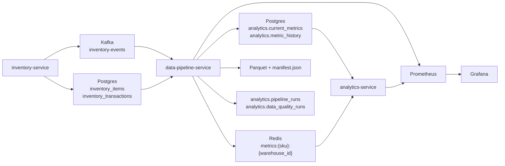

# Case Study: Event-Driven Inventory Analytics

## One-line summary

This project captures inventory mutations in a transactional service, emits Kafka events for each change, and materializes analytics into Postgres, Redis, Parquet, and monitored pipeline run metadata.

## Problem

Operational inventory systems need two things at the same time:

1. a source-of-truth write path that preserves correctness under concurrent stock changes
2. a downstream analytics path that can turn those mutations into serving-friendly metrics without losing auditability

This repo solves that by keeping the operational write path in Spring Boot and moving analytical materialization into a Python ETL pipeline that reads Kafka plus historical Postgres transactions.

## Supported architecture



## What makes it production-shaped

- Inventory writes are transactional, audited in `inventory_transactions`, and emitted as typed Kafka events with `eventId` and transaction references.
- The ETL is idempotent by default via `analytics.processed_event_log`.
- The ETL has an explicit forced reprocess mode for replaying already-seen events.
- Analytics use separate current-state and history tables: `analytics.current_metrics` and `analytics.metric_history`.
- Every ETL batch records a run manifest, DQ result, and artifact path in Postgres and on disk.
- Invalid events are rejected into `analytics.invalid_inventory_events` and published to `inventory-events-dlq`.
- Prometheus and Grafana are wired into the dev demo stack, not only the full compose stack.

## Demo proof

Run:

```bash
cp .env.example .env
make demo
```

Inspect:

- `artifacts/demo/inventory_before.json`
- `artifacts/demo/inventory_after.json`
- `artifacts/demo/current_metrics.txt`
- `artifacts/demo/pipeline_runs.txt`
- `artifacts/demo/data_quality_runs.txt`
- `artifacts/demo/latest_run_manifest.json`
- `artifacts/demo/parquet_files.txt`
- `artifacts/demo/analytics_velocity.json`

What the latest proof shows:

- `LAPTOP-001` in `WAREHOUSE-001` drops from `42` to `41` after a live sale.
- `analytics.current_metrics` contains `velocity_7d=0.5714` and `velocity_30d=0.1333`.
- The latest stream pipeline run finished `SUCCESS`.
- The latest DQ run finished `PASS`.
- The latest manifest points to a partitioned Parquet file under `data-pipeline-service/data/run_date=.../run_id=.../processed_metrics.parquet`.
- Prometheus in the demo stack scrapes only the three supported services, so the dashboard stays green instead of reporting missing full-platform components.

## Backfill and replay

Backfill a date range:

```bash
make backfill BACKFILL_START=2026-03-01T00:00:00 BACKFILL_END=2026-03-13T00:00:00
```

Force a reprocess of an already-seen range:

```bash
FORCE_REPROCESS=true make backfill BACKFILL_START=2026-03-01T00:00:00 BACKFILL_END=2026-03-13T00:00:00
```

This keeps the normal path idempotent while still giving an explicit operator-controlled replay mode.

## Data quality and observability

DQ checks cover:

- freshness
- null business keys
- uniqueness of current-state rows
- metric range validity
- reconciliation of `velocity_30d` against source `inventory_transactions`
- invalid event counts

Observability covers:

- `pipeline_last_success_timestamp`
- `pipeline_events_invalid_total`
- `pipeline_run_failures_total`
- analytics HTTP request rate and latency

Use:

- Prometheus: `http://localhost:9090`
- Grafana: `http://localhost:3001`

## Resume-ready bullets

- Built an event-driven inventory analytics pipeline using Spring Boot, Kafka, Postgres, Redis, and Python ETL to materialize current-state metrics, metric history, and partitioned Parquet outputs.
- Implemented idempotent event processing with replay controls, invalid-event capture, per-run manifests, and SQL-backed data quality checks.
- Added operational observability with Prometheus metrics, Grafana dashboards, and persisted pipeline run metadata for stream and backfill executions.

## Interview explanation

If asked to explain the project in 90 seconds:

1. Inventory writes happen transactionally in Postgres and emit Kafka events with stable IDs.
2. A Python ETL consumer validates and deduplicates those events, enriches them with historical transaction data, and computes velocity and stockout metrics.
3. The ETL writes current-state metrics to Postgres for serving, history to Postgres for auditability, Redis for low-latency reads, and Parquet for file-based output.
4. Each run persists its own run metadata, DQ result, and manifest, and the dev stack exposes all of that through Prometheus, Grafana, and demo artifacts.
