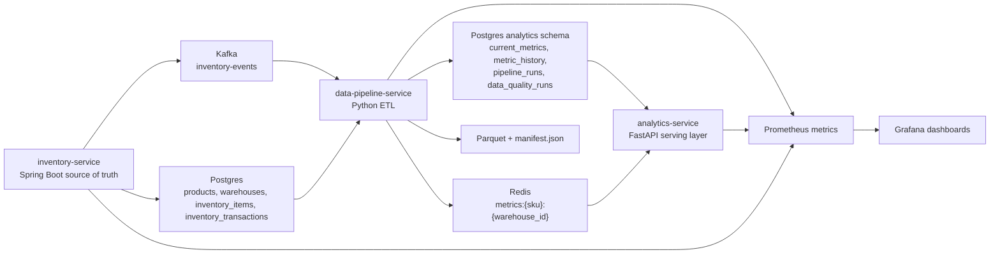

# Inventory Management System — Stockout Prevention, End-to-End

An inventory operations service plus a data engineering spine: every write flows through a transactional outbox into Kafka, gets reshaped by an idempotent Python pipeline, and is gated in CI by a stockout-prevention backtest.

## Live Demo

- Static frontend (read-only dashboard preview): _link will be added after deploying via the button below._
- Full end-to-end demo: run locally — the multi-service backend (Postgres, Kafka, Spring Boot, FastAPI, ETL) does not fit free hosting tiers.

## Deploy The Frontend

The `frontend/` directory is a static HTML/JS dashboard. It can be hosted on Vercel as a preview of the dashboard layout — note that without a reachable backend the data panels will show their loading/error states.

[](https://vercel.com/new/clone?repository-url=https://github.com/udaymukhija3/inventory-management-sys&root-directory=frontend&project-name=inventory-management-sys-frontend)

To wire the deployed frontend to a real backend, set `window.__APP_CONFIG__.API_BASE_URL` (see `frontend/js/config.js`) to a publicly reachable URL that fronts the inventory and analytics services. For the full experience, run the stack locally as described below.

## Run Locally (One Command)

```bash
git clone https://github.com/udaymukhija3/inventory-management-sys.git
cd inventory-management-sys
cp .env.example .env 2>/dev/null || true
make demo
```

This brings up the supported stack from `docker-compose.dev.yml`, seeds deterministic demo data, triggers a live sale, waits for the ETL consumer to process it, and writes proof artifacts to `artifacts/demo/`. Then open the demo monitor at [http://localhost:3000](http://localhost:3000).

Prerequisites: Docker Desktop with Compose, `make`, `curl`.

---

**The headline:** every inventory write flows through a transactional outbox →
Kafka → an idempotent Python pipeline → Postgres marts → a rule-based
recommender that is **scored every CI run** against a 90-day synthetic history.
The build fails if recall on stockout prevention regresses below 60%.

That score — recall, precision, and estimated dollars saved — is the business
metric this project defends. It is computed by `make backtest`, persisted to
`analytics.backtest_runs`, surfaced in the frontend monitor at
`http://localhost:3000`, and gated in CI.

```
inventory-service ──tx outbox──▶ Kafka ──▶ data-pipeline ──▶ analytics.daily_sales
                                                              │
                                                              ├─▶ dbt marts (sku_velocity, reorder_candidates)
                                                              └─▶ backtest harness ─▶ recall / precision / $ saved
                                                                                       │
                                                                                       └─▶ frontend tile + CI gate
```

If you are opening this repository for the first time, the simplest mental model is this: it is an inventory operations system with a data engineering spine. The operational side lets you manage products, warehouses, and stock movements. The more interesting part is what happens after each write. Inventory mutations are stored transactionally via an outbox, published to Kafka by a relay, processed by a Python ETL pipeline, and materialized into Postgres, Redis, and Parquet so analytics can be served quickly and audited later.

This repo also contains a few extra services and experiments. The README below is intentionally opinionated about where to start, because most people evaluating the project want a path that is reproducible, easy to verify, and honest about what is actually supported.

The hard boundary between supported and experimental components lives in [REPO_BOUNDARIES.md](/Users/udaymukhija/inventory_management_sys/REPO_BOUNDARIES.md).

## What This Product Is Trying To Do

At the product level, this project covers three jobs:

1. Run day-to-day inventory operations: products, categories, warehouses, stock adjustments, reservations, sales, and receipts.
2. Turn those operational writes into analytical outputs: inventory velocity, trend, stockout risk, reorder recommendations, current-state metrics, history, and cache-friendly serving data.
3. Make the whole story easy to verify locally: deterministic seed data, a one-command demo, proof artifacts, and enough observability to see what happened.

This is not pretending to be a full ERP. It is a focused system that shows how an operational service and an analytics pipeline can live together without blurring responsibilities.

## Start Here: The Supported Local Path

If you want to verify that the project works end to end, start with the supported path below and ignore the rest of the repo until you have that green.

Supported path:

- `inventory-service`
- `data-pipeline-service`
- `analytics-service`
- `frontend`
- PostgreSQL
- Redis
- Kafka + Zookeeper
- Prometheus
- Grafana

Optional or secondary pieces in this repo:

- `api-gateway`
- `reorder-service`
- `airflow`
- `stream-processor`
- full-stack `docker-compose.yml` extras like MongoDB and Elasticsearch

Those pieces are still useful, but they are not the first proof that the core product works.
They are explicitly quarantined and should not be presented as part of the supported interview/demo path.

## Architecture



## Why The System Is Interesting

- **Headline business metric defended in CI.** `analytics.backtest_runs` records recall, precision, and dollars saved on a 90-day synthetic history. CI fails if recall drops below 60%.
- **Transactional outbox eliminates the dual-write.** `inventory-service` writes the outbox row in the same DB transaction as the inventory mutation. `OutboxRelay` drains it to Kafka with `FOR UPDATE SKIP LOCKED`, max-attempts, and exponential give-up.
- **Versioned schema via Alembic.** `init.sql` is gone. Migrations 0001–0006 are the single source of truth, including the role split (`ims_source` / `ims_pipeline` / `ims_analytics`) and a retention SQL function with an audit log.
- **Two materialization paths, one canonical table.** The streaming pipeline incrementally upserts `analytics.daily_sales`; the dbt project (`stg_inventory_events` → `daily_sales` → `sku_velocity` → `reorder_candidates`) reads it and adds column-level tests via `dbt build`.
- **Column-level lineage that CI lints.** `metadata/lineage.yml` documents every dataset's columns and their derivations. `scripts/lineage_lint.py` fails the build on dangling references.
- Inventory writes are transactional and audited in `inventory_transactions`.
- The Java service uses locking and retries to keep stock changes safe under concurrent writes.
- The ETL pipeline is idempotent by default through `analytics.processed_event_log`.
- Current-state and history are modeled separately in `analytics.current_metrics` and `analytics.metric_history`.
- Redis stores hot analytics reads for low-latency serving.
- Parquet output and run manifests give you a file-based artifact trail, not just API responses.
- Each ETL run records processing counts, status, and data quality results in Postgres.
- Prometheus and Grafana are part of the supported demo path, so observability is not an afterthought.

## Core Services At A Glance

| Component | Stack | Responsibility |
| --- | --- | --- |
| `inventory-service` | Spring Boot, Java 17, Postgres, Redis, Kafka | Source-of-truth inventory APIs, transactional writes, audit rows, event publication |
| `data-pipeline-service` | Python, Kafka, Postgres, Redis, PyArrow | Consumes inventory events, computes metrics, writes current-state/history/cache/files, records DQ and run manifests |
| `analytics-service` | FastAPI, Postgres, Redis | Serves ETL-derived analytics over HTTP |
| `prometheus` + `grafana` | Prometheus, Grafana | Health, metrics, dashboards for the supported stack |
| `frontend` | Static HTML/JS via Nginx | Read-only demo monitor for the pipeline |

## Quickest Way To Verify Locally

### Prerequisites

For the supported demo path:

- Docker Desktop with Compose support
- Docker running locally
- `make`
- `curl`

Optional, only if you want to run tests outside Docker:

- Java 17
- Maven
- Python 3.11

### One-Command Demo

```bash
cp .env.example .env 2>/dev/null || true
make demo
```

That command is the best first-run experience in this repo. It:

- starts the supported stack from `docker-compose.dev.yml`
- waits for the core services to become healthy
- loads deterministic seed data from `infrastructure/docker/postgres/demo-seed.sql`
- captures inventory state before a live event
- triggers a real sale for `LAPTOP-001` in `WAREHOUSE-001`
- waits for the ETL consumer to process the event
- brings up the demo monitor at `http://localhost:3000`
- captures API, Postgres, Redis, and Parquet proof artifacts in `artifacts/demo/`

### Important Note About `.env`

You do **not** strictly need a `.env` file for the supported local demo.

The supported defaults are captured in [.env.example](/Users/udaymukhija/inventory_management_sys/.env.example), and `docker-compose.dev.yml` already provides local-safe fallbacks. Copy `.env.example` to `.env` only if you want to override credentials or set an explicit `PIPELINE_VERSION`.

The dev demo defaults are:

- inventory Basic Auth: `demo_user / demo_pass`
- Grafana: `admin / admin`
- Postgres bootstrap: `inventory_user / inventory_pass` (app services use split roles: `ims_source`, `ims_pipeline`, `ims_analytics`)
- Redis password: `redis_pass`

## What Success Looks Like

After `make demo`, here is what you should expect to see:

| Check | Where to look | Expected result |
| --- | --- | --- |
| Inventory mutation | `artifacts/demo/inventory_before.json` and `artifacts/demo/inventory_after.json` | `LAPTOP-001` in `WAREHOUSE-001` drops from `42` to `41` |
| Analytics API response | `artifacts/demo/analytics_velocity.json` | ETL-derived velocity metrics exist for the same SKU and warehouse |
| Demo monitor payload | `artifacts/demo/demo_overview.json` | one API payload shows run metadata, DQ, focus inventory, and current metrics |
| Current metrics table | `artifacts/demo/current_metrics.txt` | latest `analytics.current_metrics` row is present |
| Pipeline run metadata | `artifacts/demo/pipeline_runs.txt` | latest run status is `SUCCESS` |
| Data quality | `artifacts/demo/data_quality_runs.txt` | latest DQ status is `PASS` |
| Redis cache | `artifacts/demo/redis_metrics.txt` | `metrics:LAPTOP-001:WAREHOUSE-001` is populated |
| File output | `artifacts/demo/parquet_files.txt` and `artifacts/demo/latest_run_manifest.json` | partitioned Parquet and a run manifest exist |

If you just want one place to inspect first, open:

- `artifacts/demo/summary.md`

## URLs You Will Care About

Once the demo stack is up:

- Inventory service: [http://localhost:8080](http://localhost:8080)
- Inventory Swagger UI: [http://localhost:8080/swagger-ui/index.html](http://localhost:8080/swagger-ui/index.html)
- Analytics service: [http://localhost:8000](http://localhost:8000)
- Analytics docs: [http://localhost:8000/api/docs](http://localhost:8000/api/docs)
- Demo monitor: [http://localhost:3000](http://localhost:3000)
- Prometheus: [http://localhost:9090](http://localhost:9090)
- Grafana: [http://localhost:3001](http://localhost:3001)

## Manual Verification Checklist

If you prefer to verify things with your own eyes instead of trusting the generated artifacts, this is the shortest useful checklist.

### 1. Check service health

```bash
./scripts/health-check.sh
```

Or directly:

```bash
curl -f http://localhost:8080/actuator/health
curl -f http://localhost:8000/health/
curl -f http://localhost:9090/-/ready
curl -f http://localhost:3001/api/health
```

### 2. Read inventory for the seeded demo SKU

```bash
curl -s -u demo_user:demo_pass \
  http://localhost:8080/api/v1/inventory/LAPTOP-001/WAREHOUSE-001
```

### 3. Trigger another sale

```bash
curl -s -u demo_user:demo_pass -X POST \
  "http://localhost:8080/api/v1/inventory/sale?sku=LAPTOP-001&warehouseId=WAREHOUSE-001&quantity=1"
```

### 4. Read the analytics that were materialized from ETL output

```bash
curl -s \
  "http://localhost:8000/api/v1/analytics/velocity/LAPTOP-001/WAREHOUSE-001?period_days=30"
```

### 5. Inspect the analytics service health with pipeline freshness

```bash
curl -s http://localhost:8000/health/detailed
```

### 6. Open the demo monitor

Visit:

- [http://localhost:3000](http://localhost:3000)
- Demo runbook: [DEMO.md](/Users/udaymukhija/inventory_management_sys/DEMO.md)

What it shows:

- the latest pipeline run and DQ report
- the current inventory and current metric row for `LAPTOP-001 / WAREHOUSE-001`
- recent pipeline runs
- committed Kafka offsets, source watermark, and pipeline version for the latest run
- the latest artifact paths recorded by the pipeline
- a single "Trigger Live Sale" action that records one inventory mutation and waits for fresh analytics

### 7. Run the bundled smoke script

```bash
./scripts/test-apis.sh
```

## Data Model And Outputs Worth Inspecting

If you care about the data engineering side more than the UI, these are the tables and artifacts that tell the real story.

### Operational tables

- `products`
- `categories`
- `warehouses`
- `inventory_items`
- `inventory_transactions`

### Analytics tables

- `analytics.current_metrics`
- `analytics.metric_history`
- `analytics.pipeline_runs`
- `analytics.data_quality_runs`
- `analytics.processed_event_log`
- `analytics.invalid_inventory_events`

### Redis keys

- `metrics:{sku}:{warehouse_id}`

### File outputs

- `data-pipeline-service/data/run_date=YYYY-MM-DD/run_id=<uuid>/processed_metrics.parquet`
- `data-pipeline-service/data/run_date=YYYY-MM-DD/run_id=<uuid>/manifest.json`

## The Stockout-Prevention Backtest

The headline number lives in `analytics.backtest_runs`. To compute it:

```bash
make migrate     # apply Alembic migrations
make backtest    # generate 90-day synthetic history, score, persist
```

The backtest:

1. Generates 90 days of inventory transactions across 20 SKUs × 2 warehouses with three behavioral profiles (RISK / STEADY / DRIFT). Deterministic seed.
2. Bulk-loads `analytics.daily_sales` from that history.
3. Walks each day forward — at day `D` only data up to `D` is visible — and fires the rule-based recommender (`days_of_cover < lead_time + safety`).
4. Scores recommendations against ground-truth stockouts in the next `lead_time` days.
5. Writes recall, precision, false positives, and `estimated_value_saved_usd` to `analytics.backtest_runs`.

CI gate (`.github/workflows/ci.yml`, `data-pipeline` job): `recall >= 0.60` or the build fails. The frontend monitor reads the latest row via `GET /api/v1/analytics/backtest/latest` and renders it as the headline tile.

## dbt Layer

```bash
make dbt    # cd dbt && DBT_PROFILES_DIR=. dbt build
```

Models live under `dbt/models/`:

- `staging/stg_inventory_events.sql` — typed cleanup view over `analytics.daily_sales`
- `marts/daily_sales.sql` — canonical (sku, warehouse, day) grain
- `marts/sku_velocity.sql` — rolling 7d / 30d velocity
- `marts/reorder_candidates.sql` — same rule the backtest defends, but applied to live state

`dbt build` runs models + column-level tests in one command. The CI job `dbt-build` runs it against the same Postgres the streaming pipeline uses.

## Lineage

```bash
make lineage-lint
```

`metadata/lineage.yml` is the column-level DAG, hand-maintained alongside the SQL. The lint job (CI: `lineage-lint`) fails on:

- a dataset in `metadata/datasets.yml` that is missing from `lineage.yml`
- a `derived_from` reference that does not resolve to a known dataset/column
- a consumer reading from a dataset nobody wrote

## Useful Commands

```bash
make up
make migrate
make seed
make demo
make backtest
make dbt
make lineage-lint
make build
make test
make clean
make backfill-demo
./scripts/health-check.sh
./scripts/test-apis.sh
make backfill BACKFILL_START=2026-03-01T00:00:00 BACKFILL_END=2026-03-13T00:00:00
FORCE_REPROCESS=true make backfill BACKFILL_START=2026-03-01T00:00:00 BACKFILL_END=2026-03-13T00:00:00
```

## Backfills And Replay

The pipeline supports both normal idempotent processing and explicit replay.

Run a detected backfill for the seeded demo data:

```bash
make backfill-demo
```

Force a detected replay:

```bash
FORCE_REPROCESS=true make backfill-demo
```

Run a bounded custom backfill:

```bash
make backfill BACKFILL_START=2026-03-15T00:00:00 BACKFILL_END=2026-04-08T00:00:00
```

Force a reprocess for a range that has already been seen:

```bash
FORCE_REPROCESS=true make backfill BACKFILL_START=2026-03-15T00:00:00 BACKFILL_END=2026-04-08T00:00:00
```

That split is deliberate. Normal processing stays safe and idempotent. Replay is possible, but it is an explicit operator choice rather than an accident.

## Running Tests

`make test` runs the supported test suites:

- `inventory-service` Maven tests
- `analytics-service` pytest suite
- `data-pipeline-service` pytest suite

Recommended flow:

```bash
make up
make seed
make test
make backfill-demo
```

Or run them individually:

```bash
cd inventory-service && mvn test
./scripts/run-analytics-tests.sh
bash ./scripts/run-data-pipeline-tests.sh
```

One practical note: `scripts/run-data-pipeline-tests.sh` now probes the local Postgres target first and falls back to the Dockerized path when localhost is not the supported dev database.
It also runs against an isolated temporary test database so the pipeline test suite does not wipe out the live demo evidence.

## Operational Docs

- Demo walkthrough: [DEMO.md](/Users/udaymukhija/inventory_management_sys/DEMO.md)
- Supported-stack runbook: [OPS.md](/Users/udaymukhija/inventory_management_sys/OPS.md)
- Dataset metadata: [metadata/datasets.yml](/Users/udaymukhija/inventory_management_sys/metadata/datasets.yml)
- Backlog: [TODO.md](/Users/udaymukhija/inventory_management_sys/TODO.md)

## Repository Map

- `inventory-service/`: Spring Boot operational APIs and event publisher
- `analytics-service/`: FastAPI analytics serving layer
- `data-pipeline-service/`: stream and backfill ETL logic
- `infrastructure/docker/postgres/`: database bootstrap and deterministic seed SQL
- `scripts/`: demo, health, seed, smoke-test, and backfill helpers
- `monitoring/`: Prometheus config, alert rules, and Grafana provisioning
- `artifacts/demo/`: proof pack generated by `make demo`

## Full Compose Files And Optional Services

This repo includes `docker-compose.yml` and `docker-compose.prod.yml` for broader experiments, but they are quarantined and are not part of the supported CI or demo contract. If your goal is to answer "does this system actually work end to end?" stay with `docker-compose.dev.yml`, [REPO_BOUNDARIES.md](/Users/udaymukhija/inventory_management_sys/REPO_BOUNDARIES.md), and the commands in this README.

If you do want to explore the larger setup later, that is the point where copying `.env.example` and setting real secrets becomes worth doing.

## In Plain English

If you only remember one thing about this project, make it this:

`inventory-service` owns correctness via a transactional outbox, `data-pipeline-service` turns events into analytics + a dbt-tested mart layer, the backtest harness scores a stockout-prevention recommender against 90 days of synthetic history, and CI fails if that recall regresses. `make demo` proves the stream works; `make backtest` proves it's worth running.

## Walkthrough

A 3-minute scripted Loom walkthrough lives in [docs/LOOM_SCRIPT.md](/Users/udaymukhija/inventory_management_sys/docs/LOOM_SCRIPT.md).
